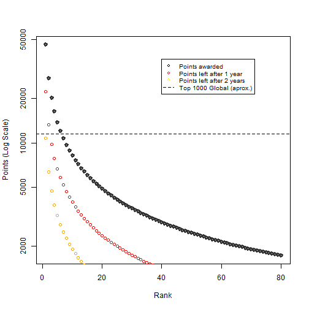

## Kaggle

Kaggle.com is a platform for data science and machine learning competitions

Individuals and teams compete for cash prizes (ranging from $250 to $100,000+), job offers, resume boosters, and bragging rights.

The Global "User Rankings" leaderboard is based on all **points** earned over a competitor's career.

--- .class #id 

## Rankings and Points

Prior to 2015, Kaggle users were awarded points on the following basis per competition:

$$latex \left[\frac{100000}{N_{teammates}}\right] \left[Rank^{-0.75}\right] \left[log_{10} (N_{teams})\right] \left[\frac{2 \ years - time}{2 \ years}\right] $$

In recent months, they changed their algorimth to the following:

$$latex \left[\frac{100000}{\sqrt{N_{teammates}}}\right] \left[Rank^{-0.75}\right] \left[log_{10}(1 + log_{10}(N_{teams}))\right] \left[e^{-t/500}\right] $$

To learn more about these changes, visit <http://blog.kaggle.com/2015/05/13/improved-kaggle-rankings/>

While rankings and points are transparent, it may be difficult for someone to quickly and intuitively understand the implications of these equations. The "Kaggle Points Calculator" can help a user better understand these equations. 

--- .class #id 

## Interactive tool

The "Kaggle Competition Point Calculator", found at <https://paulfornia.shinyapps.io/Data_Products_Project_v2>, allows a user to see a plot of points awarded vs rankings for a single contest. The tool allows the user to select a custom level for:

1. Number of members of your team
2. Number of teams in a contest
3. Old vs New point algorithm

Additionally, the tool allows the user to set a goal for points, and see exactly what rank they must achieve to obtain that level of points.

Finally, the tool shows how many points will be left after one and two years, after the decay function.

--- .class #id 

## Example Use

This tool could be used in a variety of ways. For example, I used this tool to come to the conclusion that, under the new point system, I should be focussing on smaller contests. To obtain 1500 points from a 10,000 person contest, I need to place 167th, or about the top 1.7%. In a contest of 80 people, I can get the same number of points by coming in dead last (shown below).

 
